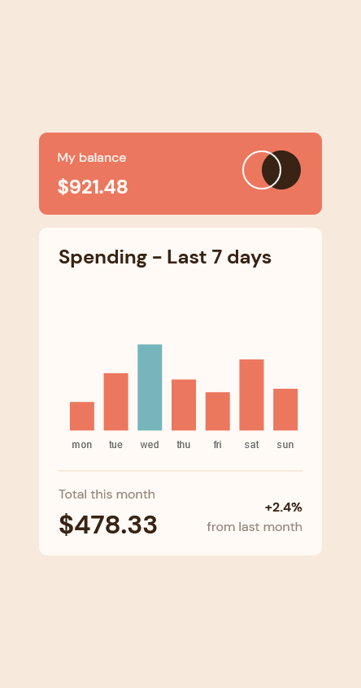

# Frontend Mentor - Expenses chart component solution

This is a solution to the [Expenses chart component challenge on Frontend Mentor](https://www.frontendmentor.io/challenges/expenses-chart-component-e7yJBUdjwt). Frontend Mentor challenges help you improve your coding skills by building realistic projects.

## Table of contents

- [Overview](#overview)
  - [The challenge](#the-challenge)
  - [Screenshot](#screenshot)
  - [Links](#links)
  - [Built with](#built-with)
  - [What I learned](#what-i-learned)
  - [Useful resources](#useful-resources)
- [Author](#author)

## Overview

### The challenge

Users should be able to:

- View the bar chart and hover over the individual bars to see the correct amounts for each day
- See the current day’s bar highlighted in a different colour to the other bars
- View the optimal layout for the content depending on their device’s screen size
- See hover states for all interactive elements on the page
- **Bonus**: Use the JSON data file provided to dynamically size the bars on the chart

### Screenshot



### Links

- Solution URL: [Add solution URL here](https://github.com/AshtonHarvey/expenses-chart-component)
- Live Site URL: [Add live site URL here](https://ashtonharveyexpensecomponent.vercel.app/)

### Built with

- Semantic HTML5 markup
- SCSS
- Flexbox
- CSS Grid
- Mobile-first workflow
- Chart.js

### What I learned

The main thing i learned from this project was the map function for arrays. This was something ive used before but I needed a good refresher on how it worked.

```js
const data = require("/data.json");

const days = data.map((object) => {
  return object["day"];
});
```

### Useful resources

- [Charts.js](https://www.chartjs.org/docs/latest/) - This helped me with figuring out all of the different options for chart.js.

## Author

- Frontend Mentor - [@AshtonHarvey](https://www.frontendmentor.io/profile/AshtonHarveye)
